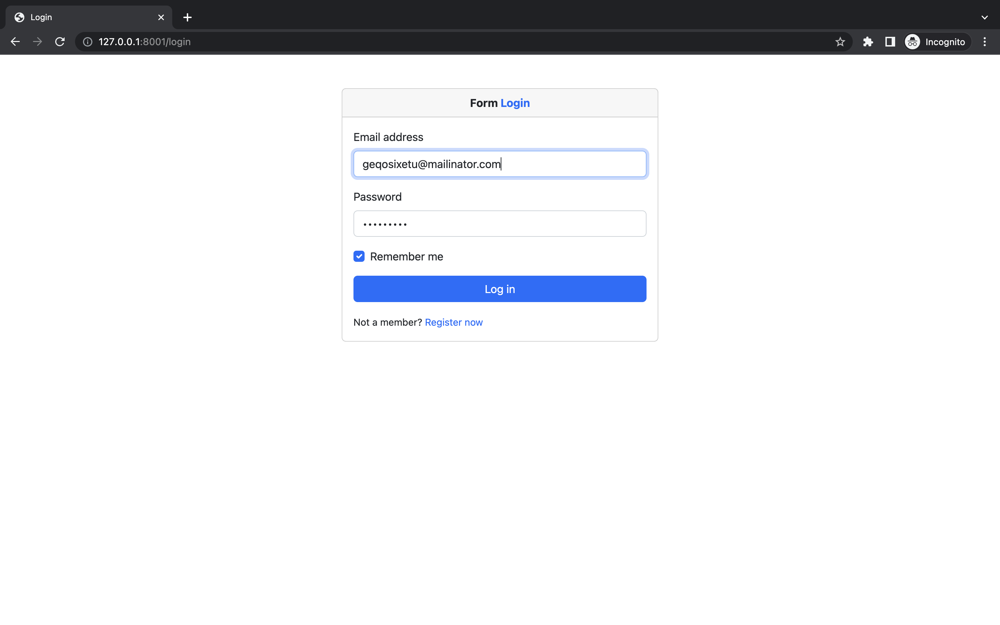
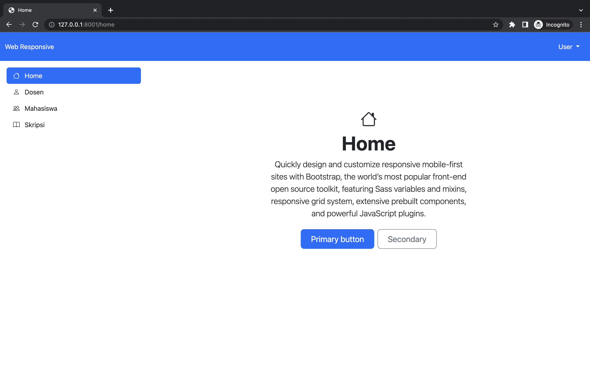
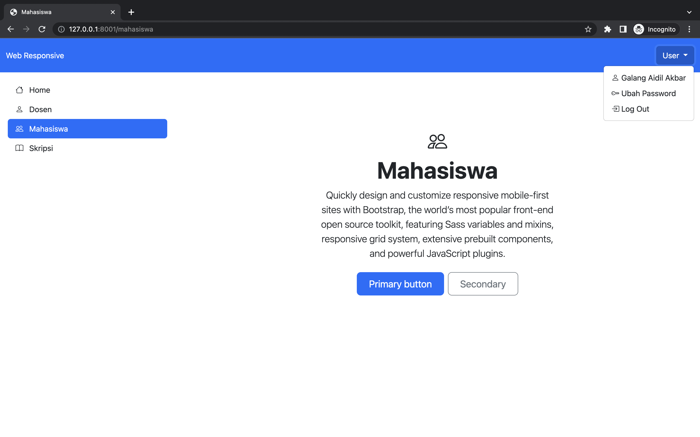
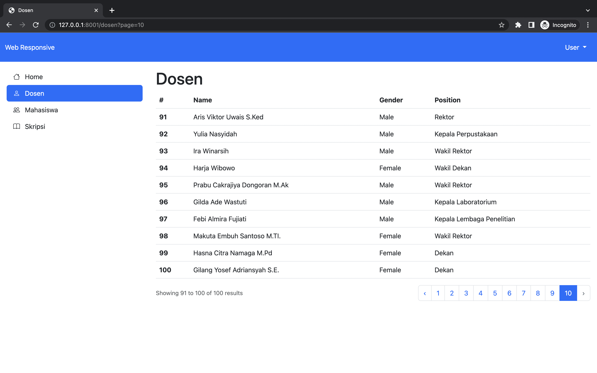
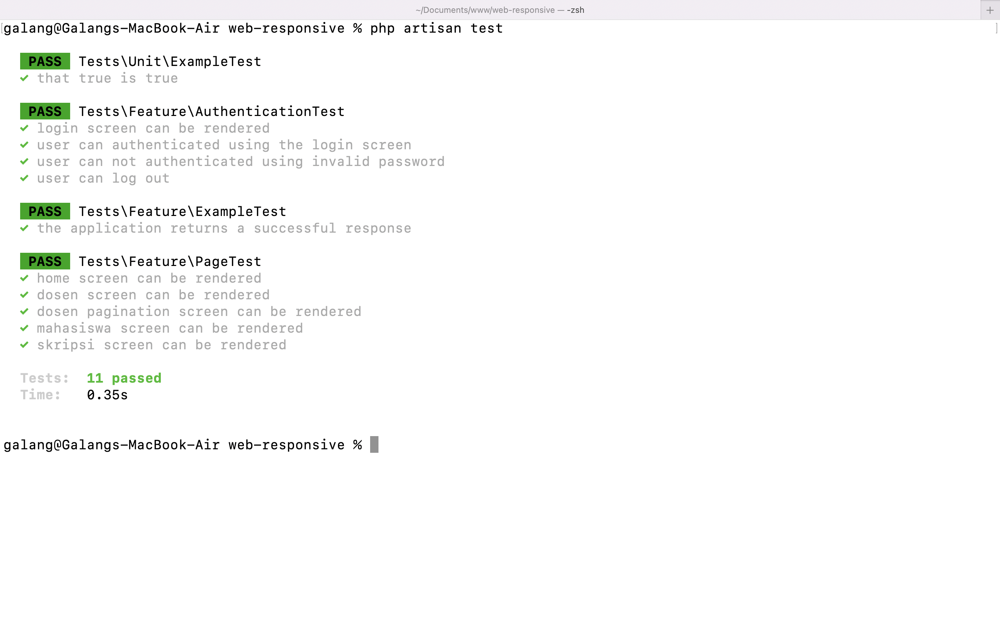

# Web Responsive

Tugas M3 dan M4

## Informasi Mahasiswa

- NPM 5190411250
- Nama Galang Aidil Akbar
- Kelas D

## Goal

1. Mampu membuat program aplikasi web menggunakan Laravel.
2. Mampu menggunakan Route, Controller, Model, Migrations, dan View yang ada di Laravel.
3. Mampu mengotentikasi pengguna dengan menerapkan fitur _authentication_.
4. Mampu menerapkan konsep _Template Inheritance_.
5. Mampu membuat data _dummy_ menggunakan Faker.
6. Mampu membuat Pagination.

## Tech Stack

- Laravel v9.16.0
- Bootstrap v5.2.0-beta1

## Implementasi

### Route

```php
Route::middleware('guest')->group(function (){
    Route::get('/login', [\App\Http\Controllers\AuthController::class, 'login'])->name('login');

    Route::post('/login', [\App\Http\Controllers\AuthController::class, 'authenticate']);
});

Route::middleware('auth')->group( function (){
    Route::get('/home', function () {
        return view('home');
    })->name('home');

    Route::get('/dosen', [\App\Http\Controllers\DosenController::class, 'index'])->name('dosen');

    Route::get('/mahasiswa', function () {
        return view('mahasiswa');
    })->name('mahasiswa');

    Route::get('/skripsi', function () {
        return view('skripsi');
    })->name('skripsi');

    Route::post('/logout', [\App\Http\Controllers\AuthController::class, 'logout'])->name('logout');
});
```

### Authetication

Login, verification, dan logout diatur oleh Controller `AuthController`.

```php
use Illuminate\Http\Request;
use Illuminate\Support\Facades\Auth;

class AuthController extends Controller
{
    public function login()
    {
        return view('login');
    }

    public function authenticate(Request $request)
    {
        $credentials = $request->validate([
            'email' => ['required', 'email'],
            'password' => ['required'],
        ]);

        if (Auth::attempt($credentials)) {
            $request->session()->regenerate();

            return redirect()->intended('/home');
        }

        return back()->withErrors([
            'email' => 'The provided credentials do not match our records.',
        ])->onlyInput('email');
    }

    public function logout(Request $request)
    {
        Auth::logout();

        $request->session()->invalidate();

        $request->session()->regenerateToken();

        return redirect('/login');
    }
}
```

<p align="center">

</p>

### Template Inheritance

Membuat _master layout_ yang berisi komponen-komponen yang digunakan berulang-ulang dan komponen yang bisa di _inject_.
Adapun komponen yang bisa digunakan berulang-ulang yaitu:

- Header
- Sidebar

Sedangkan komponen yang bisa di _inject_ yaitu:

- Title
- Content

```blade
<!doctype html>
<html lang="en">
<head>
    <meta charset="utf-8">
    <meta name="viewport" content="width=device-width, initial-scale=1">
    <title>@yield('title')</title>
    <link rel="stylesheet" href="https://cdn.jsdelivr.net/npm/bootstrap-icons@1.8.3/font/bootstrap-icons.css">
    <link href="https://cdn.jsdelivr.net/npm/bootstrap@5.2.0-beta1/dist/css/bootstrap.min.css" rel="stylesheet"
          integrity="sha384-0evHe/X+R7YkIZDRvuzKMRqM+OrBnVFBL6DOitfPri4tjfHxaWutUpFmBp4vmVor" crossorigin="anonymous">
</head>
<body>
<div class="container-fluid">
    <div class="row">
        <div class="col-lg-12 py-3 bg-primary d-flex justify-content-between align-items-center">
            <div class="text-white">
                Web Responsive
            </div>
            <div class="dropdown">
                <button class="btn btn-primary dropdown-toggle" type="button" id="dropdownMenuButton1"
                        data-bs-toggle="dropdown" aria-expanded="false">
                    User
                </button>
                <ul class="dropdown-menu" aria-labelledby="dropdownMenuButton1">
                    <li><a class="dropdown-item" href="#"><i class="bi bi-person"></i> {{ Auth::user()->name }}</a></li>
                    <li><a class="dropdown-item" href="#"><i class="bi bi-key"></i> Ubah Password</a></li>
                    <li>
                        <form action="{{ route('logout') }}" method="post">
                            @csrf

                            <button type="submit" class="dropdown-item">
                                <i class="bi bi-box-arrow-in-right"></i> Log Out
                            </button>
                        </form>
                    </li>
                </ul>
            </div>
        </div>
    </div>

    <div class="row">
        <div class="col-lg-3 p-3">
            <div class="d-flex flex-column flex-shrink-0">
                <ul class="nav nav-pills flex-column">
                    <li class="nav-item">
                        <a href="{{ route('home') }}"
                           class="nav-link {{ request()->routeIs('home') ? 'active': 'link-dark' }}"
                           aria-current="page">
                            <i class="bi bi-house me-2"></i>
                            Home
                        </a>
                    </li>
                    <li>
                        <a href="{{ route('dosen') }}"
                           class="nav-link {{ request()->routeIs('dosen') ? 'active': 'link-dark' }}">
                            <i class="bi bi-person me-2"></i>
                            Dosen
                        </a>
                    </li>
                    <li>
                        <a href="{{ route('mahasiswa') }}"
                           class="nav-link {{ request()->routeIs('mahasiswa') ? 'active': 'link-dark' }}">
                            <i class="bi bi-people me-2"></i>
                            Mahasiswa
                        </a>
                    </li>
                    <li>
                        <a href="{{ route('skripsi') }}"
                           class="nav-link {{ request()->routeIs('skripsi') ? 'active': 'link-dark' }}">
                            <i class="bi bi-book me-2"></i>
                            Skripsi
                        </a>
                    </li>
                </ul>
            </div>
        </div>

        <div class="col-lg-9 p-3">
            @yield('content')
        </div>
    </div>
</div>
<script src="https://cdn.jsdelivr.net/npm/bootstrap@5.2.0-beta1/dist/js/bootstrap.bundle.min.js"
        integrity="sha384-pprn3073KE6tl6bjs2QrFaJGz5/SUsLqktiwsUTF55Jfv3qYSDhgCecCxMW52nD2"
        crossorigin="anonymous"></script>
</body>
</html>

```

Penggunaan _master layout_ pada halaman home:

```blade
@extends('layouts.app')

@section('title', 'Home')

@section('content')
<div class="px-4 py-5 my-5 text-center">
    <span class="d-block mx-auto fs-1"><i class="bi bi-house"></i></span>
    <h1 class="display-5 fw-bold">Home</h1>
    <div class="col-lg-6 mx-auto">
        <p class="lead mb-4">Quickly design and customize responsive mobile-first sites with Bootstrap, the world’s most
            popular front-end open source toolkit, featuring Sass variables and mixins, responsive grid system,
            extensive prebuilt components, and powerful JavaScript plugins.</p>
        <div class="d-grid gap-2 d-sm-flex justify-content-sm-center">
            <button type="button" class="btn btn-primary btn-lg px-4 gap-3">Primary button</button>
            <button type="button" class="btn btn-outline-secondary btn-lg px-4">Secondary</button>
        </div>
    </div>
</div>
@endsection

```

<p align="center">

</p>

Penggunaan _master layout_ pada halaman mahasiswa:

```blade
@extends('layouts.app')

@section('title', 'Mahasiswa')

@section('content')
<div class="px-4 py-5 my-5 text-center">
    <span class="d-block mx-auto fs-1"><i class="bi bi-people"></i></span>
    <h1 class="display-5 fw-bold">Mahasiswa</h1>
    <div class="col-lg-6 mx-auto">
        <p class="lead mb-4">Quickly design and customize responsive mobile-first sites with Bootstrap, the world’s most
            popular front-end open source toolkit, featuring Sass variables and mixins, responsive grid system,
            extensive prebuilt components, and powerful JavaScript plugins.</p>
        <div class="d-grid gap-2 d-sm-flex justify-content-sm-center">
            <button type="button" class="btn btn-primary btn-lg px-4 gap-3">Primary button</button>
            <button type="button" class="btn btn-outline-secondary btn-lg px-4">Secondary</button>
        </div>
    </div>
</div>
@endsection

```

<p align="center">

</p>

### Dosen

Membuat Model Dosen beserta dengan Controller, Migration, dan Factory.

```sh
php artisan make:model Dosen -mcf
```

Migration pada model Dosen. Menentukan _schema database_ termasuk nama kolom dan tipe data.

```php
public function up()
    {
        Schema::create('dosens', function (Blueprint $table) {
            $table->id();
            $table->string('nip')->unique();
            $table->string('name');
            $table->enum('gender', ['Male', 'Female']);
            $table->string('position');
            $table->timestamps();
        });
    }
```

Model Dosen. Menentukan _field_ yang boleh di isi.

```php
class Dosen extends Model
{
    use HasFactory;

    protected $fillable = ['nip', 'name', 'gender', 'position'];
}
```

DosenFactory. Mendefinisikan nilai-nilai yang harus diterapkan pada saat memasukkan data ke dalam model Dosen. Pengisian data dilakukan dengan menggunakan libary Faker. Faker digunakan untuk menciptakan data bohongan. Dalam konteks ini, data yang di ciptakan Faker adalah:

- NIK
- Nama
- Jenis kelamin (Male / Female)
- Dan Jabatan Strukturan


```php
public function definition()
    {
        $JabatanStruktural = ['Rektor', 'Wakil Rektor', 'Dekan', 'Wakil Dekan', 'Kaprodi', 'Kepala Perpustakaan', 'Kepala Laboratorium', 'Kepala Lembaga Penelitian', 'Humas'];

        return [
            'nip' => $this->faker->nik(),
            'name' => $this->faker->name,
            'gender' => $this->faker->randomElement(['Male', 'Female']),
            'position' => $this->faker->randomElement($JabatanStruktural)
        ];
    }
```

Seeding Dosen. Mengisikan 100 data Dosen ke dalam database.

```php
public function run()
    {
        \App\Models\Dosen::factory(100)->create();
    }
```

DosenController. mengembalikan view beserta data dosen yang telah di Paginate sebanyak 10.

```php
class DosenController extends Controller
{
    public function index()
    {
        return view('dosen', ['dosens' => Dosen::paginate(10)]);
    }
}
```

View Dosen:

```blade
@extends('layouts.app')

@section('title', 'Dosen')

@section('content')
    <h1>Dosen</h1>

    <div class="table-responsive">
        <table class="table">
            <thead>
            <tr>
                <th scope="col">#</th>
                <th scope="col">Name</th>
                <th scope="col">Gender</th>
                <th scope="col">Position</th>
            </tr>
            </thead>
            <tbody>
            @foreach($dosens as $key => $dosen)
                <tr>
                    <th scope="row">{{ $dosens->firstItem() + $key}}</th>
                    <td>{{ $dosen->name }}</td>
                    <td>{{ $dosen->gender }}</td>
                    <td>{{ $dosen->position }}</td>
                </tr>
            @endforeach
            </tbody>
        </table>
    </div>

    {{ $dosens->links() }}
@endsection

```

<p align="center">

</p>

## Pengujian

### Uji Authentication

```php
class AuthenticationTest extends TestCase
{
    use RefreshDatabase;

    public function test_login_screen_can_be_rendered()
    {
        $response = $this->get('/login');

        $response->assertStatus(200);
    }

    public function test_user_can_authenticated_using_the_login_screen()
    {
        $user = User::factory()->create();

        $response = $this->post('/login', [
            'email' => $user->email,
            'password' => 'password'
        ]);

        $this->assertAuthenticated();

        $response->assertRedirect(route('home'));
    }

    public function test_user_can_not_authenticated_using_invalid_password()
    {
        $user = User::factory()->create();

        $this->post('/login', [
            'email' => $user->email,
            'password' => 'wrong password'
        ]);

        $this->assertGuest();
    }

    public function test_user_can_log_out()
    {
        $user = User::factory()->create();

        $this->actingAs($user)->post(route('logout'));

        $this->assertGuest();
    }
}
```

### Uji Halaman

```php
class PageTest extends TestCase
{
    use RefreshDatabase;

    public function test_home_screen_can_be_rendered()
    {
        $user = User::factory()->create();

        $response = $this->actingAs($user)->get(route('home'));

        $response->assertStatus(200);
    }

    public function test_dosen_screen_can_be_rendered()
    {
        $user = User::factory()->create();

        $response = $this->actingAs($user)->get(route('dosen'));

        $response->assertStatus(200);
    }

    public function test_dosen_pagination_screen_can_be_rendered()
    {
        $user = User::factory()->create();

        $response = $this->actingAs($user)->get(route('dosen') . '?page=5');

        $response->assertStatus(200);
    }

    public function test_mahasiswa_screen_can_be_rendered()
    {
        $user = User::factory()->create();

        $response = $this->actingAs($user)->get(route('mahasiswa'));

        $response->assertStatus(200);
    }

    public function test_skripsi_screen_can_be_rendered()
    {
        $user = User::factory()->create();

        $response = $this->actingAs($user)->get(route('skripsi'));

        $response->assertStatus(200);
    }
}
```

### Hasil Pengujian

<p align="center">

</p>


